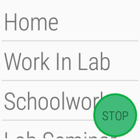
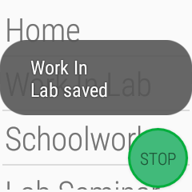

# WearableDataCollector
Wear OS (Android) app for collecting BLE device scans and watch sensor data (e.g. IMU, PPG, Bluetooth Low Energy)

This application has been built for the Polar M600 Android Smart watch, specifically Wear OS 2.0 (Android 8.0). Older versions of Android handle background services (which are necessary for long-term data collection) differently, so it is unlikely the application will function properly on versions older than Android 8.0, regardless of the brand and model.

## Installation
To run this app, download Android Studio as is. Once installed, you will likely need to install Android SDK Build-Tools 28.0.3 to build the app for Android 8.0 systems. 

Installing the application to the watch takes a few extra steps before the APK can be installed via USB cable. 
1. The watch must be on Android 8.0 (Check Settings -> System -> About -> Version)
2. Enable Developer Options: Go to Settings -> System -> About, and tap "Build Number" until a message, "You are now a developer!" displays.
3. Enable ADB debugging: Go to Settings -> Developer options, and make sure ADB debugging is on.
4. Connect the watch to the computer with Android Studio. A dialog message should show asking for permission to debug; grant permission. 

Running the app through Android studio will not load the data collection app onto the watch. The screen will ask for two types of permission (access to sensors, access to location i.e. Bluetooth). Once these are granted, the watch is ready for data collection.

## Usage
This application features a simple interface for selecting an activity label and starting/stopping data collection. The three images below show the watch face with data service off (left) and data service on (middle) and just after a label entry has been pressed (right)

, , 

The Polar M600 model is capable of data collection for 8-12 hours, depending on how much the user uses the watch otherwise (including a pairing to their phone). 

#### Data Retrieval
The watch will store at least two weeks' data before it starts showing a message that storage is filling up. To retrieve data, there are several options; the first option, ADB debugging is the simplest and most straightforward.
- ADB Debugging: Connect the watch to Android studio as if the app were being installed. Open the Device File Explorer (View -> Tool Windows -> Device File Explorer.
    - Navigate to data/data/data/com.datacollector/files/DC/{WATCH SERIAL NO} and save the desired folders containing all files for individual days of data
- HTTP: When installing, the member of model.Const, SELECTED_TRANSFER_METHOD should be TM_HTTP, and the server IP in the SERVER_ADDRESS string variable 
    - When the watch is plugged in, it will attempt to POST each day's data as a .zip file to an HTTP server at the provided address on port 9000
    - This will attempt to upload via Wi-Fi; ensure the watch is properly connected
    - If the paired phone is nearby, it may prevent successful transmission of data. It is recommended to temporarily turn off Bluetooth on the phone during transfers

## Contribution
To contribute to this repo, contact the current repo owner to be granted access. A separate README exists under WearableDataCollector/app/src/main/java/data/com/datacollector/ to explain some of the basic functionalities from a more software oriented standpoint. 

In addition, several branches (roger-thesis, temple-projeect) of this repo have additional features for data extraction, annotation, collection, etc. Roger Solis is the main contributer to these branches; his adviser, Dr. Bobak Mortazavi, should be able to initiate contact with Roger if necessary
